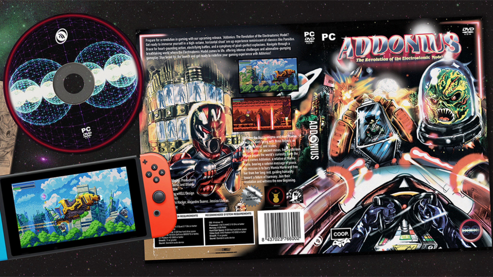
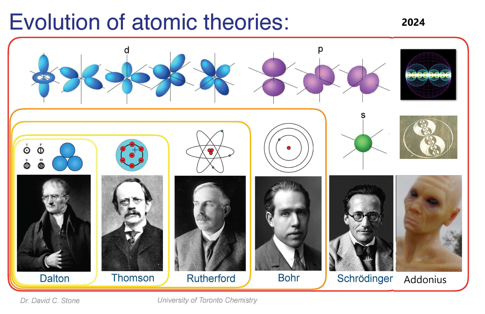
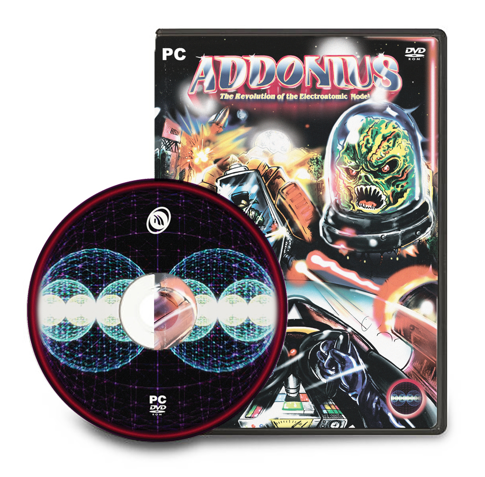

# Addonius-Game

Addonius Space Shooter Game FREE for PC & Android. Open Source (but limited) Project for Unity, see more in [license.txt](license.txt) file. See ["Releases"](https://github.com/Add0nius/Addonius-Game/releases) section in GitHub repository to download the installables or development packages. Links:
- [Addonius Website](https://www.addonius.com/)
- [FREE in Microsoft Store](https://apps.microsoft.com/detail/9mzrr85c48nm?hl=en-us&gl=US)
- [FREE in Google Play Store](https://play.google.com/store/apps/details?id=com.Addonius.Addonius)
- [FREE in Itch.io](https://addonius.itch.io/addonius)

Prepare for a revolution in gaming with our upcoming release, 'Addonius: The Revolution of the Electroatomic Model'! Get ready to immerse yourself in a high-octane, horizontal shoot 'em up experience reminiscent of classics like Paroidus. Brace for heart-pounding action, electrifying battles, and a symphony of pixel-perfect explosions. Navigate through a breathtaking world where the Electroatomic Model comes to life, offering intense challenges and adrenaline-pumping gameplay. Stay tuned for the launch and get ready to redefine your gaming experience with Addonius! 

Get ready for an adrenaline-pumping space adventure! Pedriki Hacker has unveiled an electrifying new trailer for the highly anticipated horizontal spaceship game, "ADDONIUS." In this thrilling title, prepare to navigate through epic challenges and cosmic battles that will keep you on the edge of your seat.

